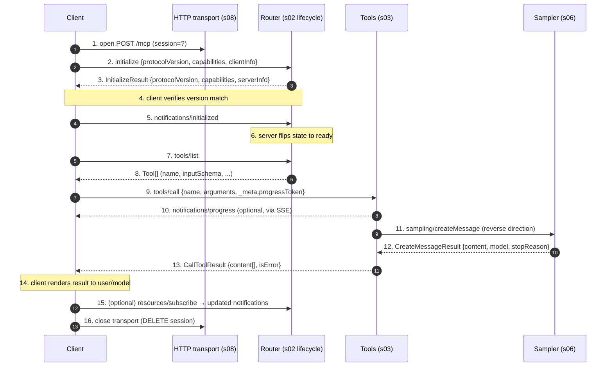

# s_full · End-to-end integration trace

> What this teaches: the eight previous chapters were intentionally isolated — one mechanism each, each module its own `go.mod`. This chapter stitches them together once, in prose, so you can see how a real client takes a single tool call from transport open to transport close. No new production code; just the canonical 16-step trace, the sequence diagram, and a careful list of what we deliberately did **not** build.

---

## Problem

After s01-s08 you have eight runnable subsets of MCP, each in its own Go module, each with five tests and a `make demo`. You can run any one of them, and each chapter "What Changed" section explains what one isolated layer added to the picture. What you do **not** have is a single trace that *threads* all the layers — opening a transport, negotiating capabilities, listing and calling a tool, having that tool reach back through `sampling/createMessage`, and tearing the session down — in one continuous sequence.

That gap matters because MCP's design only makes sense when the layers compose. The lifecycle gate (s02) only earns its keep when a *later* method (s03's `tools/call`) tries to run before `notifications/initialized` is in. The reverse-direction request shape (s06) only earns its keep when a tool decides mid-call that it needs to ask the model a question. And the SSE upgrade rule (s08) only earns its keep when a sampling-driven tool runs over HTTP. This chapter is the single trace that exercises all of those joins at once.

## Solution

We pin the integration to the **16-step end-to-end execution trace** from the A3 research dossier and walk it once, top to bottom, with arrows numbered 1..16 so each step maps to exactly one upstream spec section and one schema reference. The diagram below shows the three roles a real deployment has — **Client** (the LLM application), the **HTTP transport** layer (s08's `/mcp` POST + SSE), and inside the server the **Router** that dispatches to **Tools** (s03) and **Sampling** (s06). Roots, elicitation, prompts, and resources are deliberately *not* on this critical path; they get the "deliberate omissions" section below.



Read the diagram top-to-bottom; every arrow has a number that matches a row in the table below. Steps 1, 7, 9, 13, 16 are the "happy path" you'd see if no sampling was needed. Steps 10-12 are the SSE-upgraded interlude where the tool reaches back through the client to the model — this is what makes MCP *bidirectional*, and it is the load-bearing pedagogy of s06 and s08 combined.

## The 16-step execution trace

| Step | Action | Spec section | Schema reference |
|------|--------|--------------|------------------|
| 1 | Client opens transport (spawn subprocess for stdio; open HTTP session) | `basic/transports.mdx` | — |
| 2 | Client sends `initialize` request with `protocolVersion` + `ClientCapabilities` + `clientInfo` | `basic/lifecycle.mdx:40-51` | `schema.ts:253-273` |
| 3 | Server responds with `InitializeResult` (`protocolVersion`, `ServerCapabilities`, `serverInfo`, `instructions`) | `basic/lifecycle.mdx:98-144` | `schema.ts:277-300` |
| 4 | Client verifies version match; mismatch → disconnect | `basic/lifecycle.mdx:165-175` | `schema.ts:261, 285` |
| 5 | Client sends `notifications/initialized` to mark init done | `basic/lifecycle.mdx:147-154` | `schema.ts:298-304` |
| 6 | Server sets up capability-dependent state (e.g., subscriber tables) | `basic/lifecycle.mdx:157-163` | `schema.ts:388-459` |
| 7 | Client calls `tools/list` to discover tools | `server/tools.mdx:55-70` | `schema.ts:1086-1092` |
| 8 | Server returns `Tool[]` (name, description, `inputSchema`, optional `outputSchema`, `execution`, `annotations`) | `server/tools.mdx:73-109` | `schema.ts:1093-1104` |
| 9 | Client picks a tool and sends `tools/call` with `arguments` + optional `_meta.progressToken` | `server/tools.mdx:114-129` | `schema.ts:1135-1159` |
| 10 | Server may emit `notifications/progress` with `progressToken` | `basic/utilities/progress.mdx` | `schema.ts:583+` |
| 11 | Server may trigger `sampling/createMessage` (server→client LLM request) or `elicitation/create` | `client/sampling.mdx`, `client/elicitation.mdx` | `schema.ts:1574+, 2161+` |
| 12 | Client returns sampling or elicitation result | `client/sampling.mdx` | `schema.ts` (`CreateMessageResult`, `ElicitResult`) |
| 13 | Server finishes; sends `tools/call` result with `content[]` + `isError` | `server/tools.mdx:132-148` | `schema.ts:1160+` |
| 14 | Client renders result to user/model | — | — |
| 15 | (Optional) Client subscribes via `resources/subscribe`; server emits `notifications/resources/updated` | `server/resources.mdx` | `schema.ts:800+` |
| 16 | Client closes transport (close subprocess; HTTP session ends) | `basic/transports.mdx` | — |

Prose pointers for the joins that span chapters:

- **Step 1 vs step 16.** Over stdio (s01-s07), "open" means *spawn the child process*; "close" means *close stdin / wait for exit*. Over HTTP (s08), "open" is the first POST with no `Mcp-Session-Id` header; "close" is `DELETE /mcp` with the session header. The JSON-RPC envelope inside is identical either way — the whole point of the `Framer` abstraction in the plan's shared types catalog.
- **Steps 2-6: the lifecycle gate.** This is the entire payload of s02. Any method other than `initialize` arriving before step 5 lands on the rejection path with `-32002 server not initialized`. The order — `initialize` (request), `InitializeResult` (response), `notifications/initialized` (one-way) — is asymmetric on purpose: the third message has no reply because the server is allowed to start emitting on the channel the moment it receives it.
- **Steps 7-9: capability-gated discovery.** `tools/list` is only legal because the server advertised `capabilities.tools` in step 3. The client SHOULD remember that capability set and refuse to even send a method the server didn't advertise; the server MUST reject it with `-32601` if it slips through.
- **Steps 10-12: the SSE interlude.** Over stdio this happens "for free" — the channel is always open in both directions. Over HTTP it requires the POST that started step 9 to have upgraded to `text/event-stream` (s08's "Two response futures, one endpoint" decision). The sampling response in step 12 comes back on a *different* HTTP connection (a fresh POST) and is demultiplexed by request ID through the per-session pending table.
- **Step 13.** This is the *originating* response to step 9. Even if it never needs sampling, the server still owes the client exactly one `CallToolResult` for that request ID. Domain failures live inside `isError`, not in a JSON-RPC error envelope (s03's load-bearing pedagogy).
- **Step 15.** Off the critical path. It demonstrates the *push* direction — the server emits `notifications/resources/updated` without the client asking. Over HTTP this rides the GET stream from s08.

## Deliberate omissions

A 16-step trace cannot cover everything in the spec, and we made deliberate choices about what to **leave out** of this curriculum's critical path. Each item below is a real, normative piece of the MCP surface; we list them here so a learner finishing s_full has an honest map of what they *haven't* built yet.

- **Authorization (OAuth 2.1, OIDC).** The 2025-11-25 spec section on authorization delegates to standard OAuth 2.1 + OIDC; we delegated further, to the transport layer. A production HTTP server would put an auth gate in front of `/mcp`. Our s08 binds to `127.0.0.1` and trusts the caller, which is exactly what the spec's "local server security" guidance allows (`basic/authorization.mdx` is the read).
- **HTTP+SSE 2024-11-05 fallback transport.** The earlier dual-endpoint transport (`/sse` for server→client, `/message` for client→server) is still in the spec for compatibility. s08 only ships the 2025-11-25 unified `/mcp` endpoint. Listed in the plan's Appendix B as an extension exercise.
- **Batched JSON-RPC.** The spec allows a POST body to be a *batch* (JSON array of envelopes); s08 only handles a single envelope per POST. Adding batch decode is a 20-line change but it muddies the request/response shape; we chose clarity over throughput.
- **`completion/complete`.** Sketched in s05 for prompt argument autocomplete but not on the integration trace. It's a client→server request that *informs* a UI rather than driving a flow; it doesn't compose with sampling or tools the way step 11 does.
- **Tasks (SEP-1686).** The async task primitive — `tasks/get`, `tasks/result`, `tasks/cancel`, augmented requests with a `taskId` — is listed in the dossier as a "backup mechanism" precisely because it lives orthogonally to the synchronous trace above. If a tool takes minutes, you'd want this; the curriculum stops at the synchronous shape.
- **`notifications/cancelled`.** The cancellation notification (`schema.ts:211-249`) lets either side cancel a pending request. It's a one-way message with no response and is best taught alongside Tasks; both are on the extension list in Appendix B.
- **Logging (`logging/setLevel` + `notifications/message`).** Real servers ship this; ours stub the capability flag and stop there.
- **Roots and elicitation in the critical path.** s07 builds both. They appear in step 11 as alternatives to `sampling/createMessage`, but the diagram shows the sampling case because the multi-model abstraction is what makes MCP interesting at the protocol level.

The thread tying these omissions together: each is *additive*. None of them changes the shape of steps 1-16; each is another method or notification that hangs off the same router and rides the same transport.

## Try It

The integration trace runs end-to-end inside `agents/s08-streamable-http`. Its `make demo` already drives steps 1 (transport open), 2-6 (initialize handshake), 9-13 (tools/call with a sampling round-trip), and 16 (transport close):

```bash
cd agents/s08-streamable-http
make demo
```

Expected output (abridged):

```
[demo] initialize → session=957a70ce941ab062ecf1d6e45be9718a
[demo]   body={"jsonrpc":"2.0","id":1,"result":{"protocolVersion":"2025-11-25","capabilities":{"tools":{"listChanged":true}},"serverInfo":{...}}}
[demo] tools/call → upgraded to SSE
[demo]   ← sampling/createMessage id="s8-1"      # step 11
[demo]   → posted sampling response               # step 12
[demo] tools/call result: {"content":[{"type":"text","text":"MCP is a JSON-RPC protocol for LLMs."}]}   # step 13
```

To see the assertions in code form, run s08's own test suite — its five tests cover most of the critical path:

```bash
cd agents/s08-streamable-http
make test
```

Coverage map between s08's tests and the 16-step trace:

- `TestPOSTInitializeReturnsJSONAndSessionID` → steps 1, 2, 3.
- `handshake` helper (called by every other test) → steps 4, 5.
- `TestPOSTToolsCallUpgradesToSSEAndRoundTripsSampling` → steps 9, 11, 12, 13 (with the SSE upgrade that step 11 demands).
- `TestGETStreamReceivesNotification` → step 15 (the push direction).
- `TestPOSTWithoutProtocolHeaderRejected` → header enforcement that gates every step ≥ 7.

The one slice of the trace s08's tests do not cover is step 7-8 (`tools/list`). The demo client in `agents/s08-streamable-http/main.go` does call it; you can see it on stdout when `make demo` runs.

**Optional Go test (left as an exercise).** You could add `agents/s_full-integration/trace_test.go` that spawns the s08 binary as a subprocess, drives all 16 steps from a fresh client, and asserts the transcript line-by-line against a golden file. The skeleton would be: `exec.Command("./s08-streamable-http", "-addr", "127.0.0.1:0")` → parse the bound port → run an HTTP client through steps 1-16 → diff against `trace.golden.jsonl`. The reason we did not ship it: s08's `server_test.go` already exercises the same wire shape using `httptest.Server`, which is faster and avoids the binary-build dependency. If you'd find value in the end-to-end black-box version, the recipe above is enough to build it from scratch in ~150 lines of Go.

## Upstream Source Reading

The 16 steps cite 12 distinct upstream sections; the table below gives a permalink to each, pinned to the curriculum's locked commit `85ec377139c3026d98086eadbb23806e65517f21`.

- Step 1, 16 — Transport open/close: [`basic/transports.mdx`](https://github.com/modelcontextprotocol/modelcontextprotocol/blob/85ec377139c3026d98086eadbb23806e65517f21/docs/specification/2025-11-25/basic/transports.mdx).
- Step 2 — `initialize` request shape: [`basic/lifecycle.mdx#L40-L51`](https://github.com/modelcontextprotocol/modelcontextprotocol/blob/85ec377139c3026d98086eadbb23806e65517f21/docs/specification/2025-11-25/basic/lifecycle.mdx#L40-L51); schema [`schema.ts#L253-L273`](https://github.com/modelcontextprotocol/modelcontextprotocol/blob/85ec377139c3026d98086eadbb23806e65517f21/schema/2025-11-25/schema.ts#L253-L273).
- Step 3 — `InitializeResult`: [`basic/lifecycle.mdx#L98-L144`](https://github.com/modelcontextprotocol/modelcontextprotocol/blob/85ec377139c3026d98086eadbb23806e65517f21/docs/specification/2025-11-25/basic/lifecycle.mdx#L98-L144); schema [`schema.ts#L277-L300`](https://github.com/modelcontextprotocol/modelcontextprotocol/blob/85ec377139c3026d98086eadbb23806e65517f21/schema/2025-11-25/schema.ts#L277-L300).
- Step 4 — Version negotiation: [`basic/lifecycle.mdx#L165-L175`](https://github.com/modelcontextprotocol/modelcontextprotocol/blob/85ec377139c3026d98086eadbb23806e65517f21/docs/specification/2025-11-25/basic/lifecycle.mdx#L165-L175).
- Step 5 — `notifications/initialized`: [`basic/lifecycle.mdx#L147-L154`](https://github.com/modelcontextprotocol/modelcontextprotocol/blob/85ec377139c3026d98086eadbb23806e65517f21/docs/specification/2025-11-25/basic/lifecycle.mdx#L147-L154); schema [`schema.ts#L298-L304`](https://github.com/modelcontextprotocol/modelcontextprotocol/blob/85ec377139c3026d98086eadbb23806e65517f21/schema/2025-11-25/schema.ts#L298-L304).
- Step 6 — Capability tree: [`basic/lifecycle.mdx#L157-L163`](https://github.com/modelcontextprotocol/modelcontextprotocol/blob/85ec377139c3026d98086eadbb23806e65517f21/docs/specification/2025-11-25/basic/lifecycle.mdx#L157-L163); schema [`schema.ts#L388-L459`](https://github.com/modelcontextprotocol/modelcontextprotocol/blob/85ec377139c3026d98086eadbb23806e65517f21/schema/2025-11-25/schema.ts#L388-L459).
- Step 7 — `tools/list`: [`server/tools.mdx#L55-L70`](https://github.com/modelcontextprotocol/modelcontextprotocol/blob/85ec377139c3026d98086eadbb23806e65517f21/docs/specification/2025-11-25/server/tools.mdx#L55-L70); schema [`schema.ts#L1086-L1092`](https://github.com/modelcontextprotocol/modelcontextprotocol/blob/85ec377139c3026d98086eadbb23806e65517f21/schema/2025-11-25/schema.ts#L1086-L1092).
- Step 8 — `Tool[]` shape: [`server/tools.mdx#L73-L109`](https://github.com/modelcontextprotocol/modelcontextprotocol/blob/85ec377139c3026d98086eadbb23806e65517f21/docs/specification/2025-11-25/server/tools.mdx#L73-L109); schema [`schema.ts#L1093-L1104`](https://github.com/modelcontextprotocol/modelcontextprotocol/blob/85ec377139c3026d98086eadbb23806e65517f21/schema/2025-11-25/schema.ts#L1093-L1104).
- Step 9 — `tools/call`: [`server/tools.mdx#L114-L129`](https://github.com/modelcontextprotocol/modelcontextprotocol/blob/85ec377139c3026d98086eadbb23806e65517f21/docs/specification/2025-11-25/server/tools.mdx#L114-L129); schema [`schema.ts#L1135-L1159`](https://github.com/modelcontextprotocol/modelcontextprotocol/blob/85ec377139c3026d98086eadbb23806e65517f21/schema/2025-11-25/schema.ts#L1135-L1159).
- Step 10 — Progress notifications: [`basic/utilities/progress.mdx`](https://github.com/modelcontextprotocol/modelcontextprotocol/blob/85ec377139c3026d98086eadbb23806e65517f21/docs/specification/2025-11-25/basic/utilities/progress.mdx); schema [`schema.ts#L583`](https://github.com/modelcontextprotocol/modelcontextprotocol/blob/85ec377139c3026d98086eadbb23806e65517f21/schema/2025-11-25/schema.ts#L583).
- Step 11 — Sampling / elicitation: [`client/sampling.mdx`](https://github.com/modelcontextprotocol/modelcontextprotocol/blob/85ec377139c3026d98086eadbb23806e65517f21/docs/specification/2025-11-25/client/sampling.mdx); [`client/elicitation.mdx`](https://github.com/modelcontextprotocol/modelcontextprotocol/blob/85ec377139c3026d98086eadbb23806e65517f21/docs/specification/2025-11-25/client/elicitation.mdx); schema [`schema.ts#L1574`](https://github.com/modelcontextprotocol/modelcontextprotocol/blob/85ec377139c3026d98086eadbb23806e65517f21/schema/2025-11-25/schema.ts#L1574) / [`schema.ts#L2161`](https://github.com/modelcontextprotocol/modelcontextprotocol/blob/85ec377139c3026d98086eadbb23806e65517f21/schema/2025-11-25/schema.ts#L2161).
- Step 12 — `CreateMessageResult` / `ElicitResult`: [`client/sampling.mdx`](https://github.com/modelcontextprotocol/modelcontextprotocol/blob/85ec377139c3026d98086eadbb23806e65517f21/docs/specification/2025-11-25/client/sampling.mdx).
- Step 13 — `CallToolResult`: [`server/tools.mdx#L132-L148`](https://github.com/modelcontextprotocol/modelcontextprotocol/blob/85ec377139c3026d98086eadbb23806e65517f21/docs/specification/2025-11-25/server/tools.mdx#L132-L148); schema [`schema.ts#L1160`](https://github.com/modelcontextprotocol/modelcontextprotocol/blob/85ec377139c3026d98086eadbb23806e65517f21/schema/2025-11-25/schema.ts#L1160).
- Step 15 — `resources/subscribe` + `notifications/resources/updated`: [`server/resources.mdx`](https://github.com/modelcontextprotocol/modelcontextprotocol/blob/85ec377139c3026d98086eadbb23806e65517f21/docs/specification/2025-11-25/server/resources.mdx); schema [`schema.ts#L800`](https://github.com/modelcontextprotocol/modelcontextprotocol/blob/85ec377139c3026d98086eadbb23806e65517f21/schema/2025-11-25/schema.ts#L800).

For the integration story across the whole spec, the single best entry point is [`docs/specification/2025-11-25/index.mdx`](https://github.com/modelcontextprotocol/modelcontextprotocol/blob/85ec377139c3026d98086eadbb23806e65517f21/docs/specification/2025-11-25/index.mdx) — read it once you've finished the table above, and the cross-references should already feel familiar.
