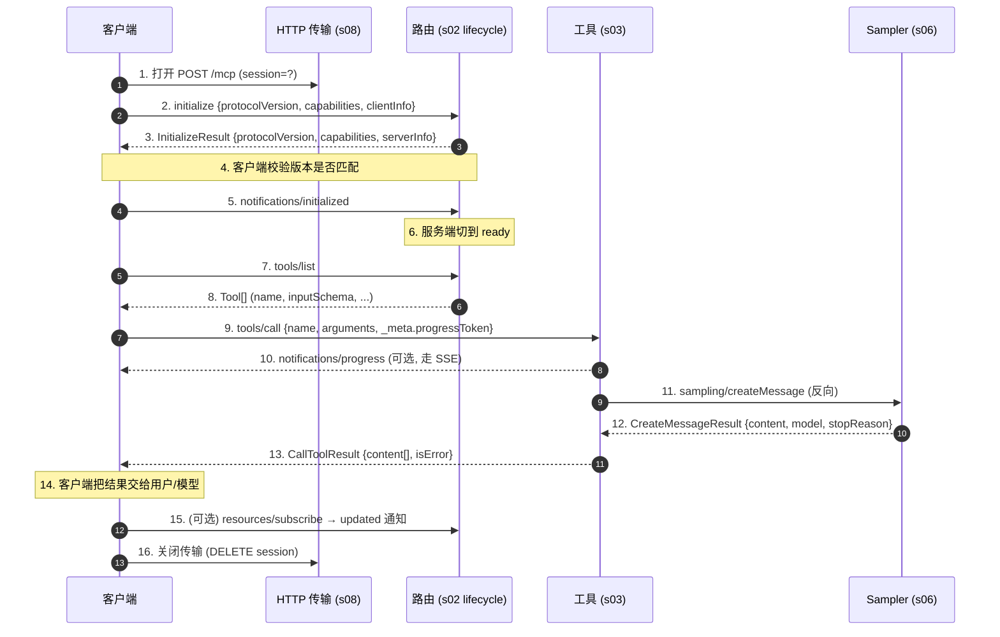

# s_full · 端到端集成穿刺

> 本章教你什么：前八章是刻意被隔离的——每章一个机制、每个模块自己一份 `go.mod`。本章用散文把它们串起来跑一遍，让你看清真实客户端如何把一次工具调用从"打开传输"一路走到"关闭传输"。不写新的生产代码；只展示那条经典的 16 步穿刺、配套的时序图，以及一份认真写下来的"我们刻意**没做**什么"清单。

---

## 问题

跑完 s01-s08 你已经手里握着八个能跑的 MCP 子集，每个子集自己一份 Go module，自己五个测试，自己 `make demo`。你能挨个跑起来，每章的"与上一章的差异"也告诉了你这一层在画面上加进去了什么。但你**没有**的，是一条把所有层都**串起来**的穿刺——打开传输、协商能力、列举并调用工具、那个工具反向通过 `sampling/createMessage` 回来问模型一句话、最后把会话拆掉——一气呵成。

这条缺口很关键，因为 MCP 的设计只有在各层组合时才说得通。生命周期门（s02）只有在**后面**某个方法（s03 的 `tools/call`）试图在 `notifications/initialized` 进来之前跑时，才显得有必要。反向请求的形状（s06）只有在工具调用过程中临时决定要问模型一句话时，才显得有必要。SSE 升级规则（s08）也只有在一个会触发 sampling 的工具跑在 HTTP 上时，才显得有必要。本章就是同时跑通这些接缝的那一次穿刺。

## 解决方案

我们把集成钉在 A3 研究档案给出的**16 步端到端执行穿刺**上，从上到下走一遍，箭头按 1..16 编号，使每一步精确对应一段上游规范、一段 schema。下面的图展示的是真实部署里的三个角色——**客户端**（LLM 应用）、**HTTP 传输层**（s08 的 `/mcp` POST + SSE）、以及服务端内部的**路由器**（分发到**工具**（s03）和 **Sampling**（s06））。Roots、elicitation、prompts、resources 都**不**在关键路径上；它们留给下一节"刻意省略"。



把图从上往下读；每条箭头的编号都能在下一节的表里找到对应行。第 1、7、9、13、16 步是"不需要 sampling 时"的快乐路径。第 10-12 步是 SSE 升级后那段插曲——工具反向穿过客户端去问模型，这就是 MCP **双向**的所在，也是 s06 和 s08 合在一起承担的核心教学价值。

## 16 步执行穿刺

| 步骤 | 动作 | 规范小节 | Schema 引用 |
|------|------|----------|-------------|
| 1 | 客户端打开传输（stdio 时启动子进程；HTTP 时开会话） | `basic/transports.mdx` | — |
| 2 | 客户端发出 `initialize` 请求，带 `protocolVersion` + `ClientCapabilities` + `clientInfo` | `basic/lifecycle.mdx:40-51` | `schema.ts:253-273` |
| 3 | 服务端回 `InitializeResult`（`protocolVersion`、`ServerCapabilities`、`serverInfo`、`instructions`） | `basic/lifecycle.mdx:98-144` | `schema.ts:277-300` |
| 4 | 客户端校验版本是否匹配；不匹配 → 断开 | `basic/lifecycle.mdx:165-175` | `schema.ts:261, 285` |
| 5 | 客户端发出 `notifications/initialized`，标志初始化完成 | `basic/lifecycle.mdx:147-154` | `schema.ts:298-304` |
| 6 | 服务端构建依赖能力的状态（订阅表等） | `basic/lifecycle.mdx:157-163` | `schema.ts:388-459` |
| 7 | 客户端调 `tools/list` 发现工具 | `server/tools.mdx:55-70` | `schema.ts:1086-1092` |
| 8 | 服务端返回 `Tool[]`（name、description、`inputSchema`、可选 `outputSchema`、`execution`、`annotations`） | `server/tools.mdx:73-109` | `schema.ts:1093-1104` |
| 9 | 客户端选一个工具，发出 `tools/call`，带 `arguments` + 可选 `_meta.progressToken` | `server/tools.mdx:114-129` | `schema.ts:1135-1159` |
| 10 | 服务端可以借 `progressToken` 发出 `notifications/progress` | `basic/utilities/progress.mdx` | `schema.ts:583+` |
| 11 | 服务端可能触发 `sampling/createMessage`（服务端→客户端 LLM 请求）或 `elicitation/create` | `client/sampling.mdx`、`client/elicitation.mdx` | `schema.ts:1574+, 2161+` |
| 12 | 客户端回 sampling 或 elicitation 的结果 | `client/sampling.mdx` | `schema.ts`（`CreateMessageResult`、`ElicitResult`） |
| 13 | 服务端结束，发出 `tools/call` 结果，带 `content[]` + `isError` | `server/tools.mdx:132-148` | `schema.ts:1160+` |
| 14 | 客户端把结果渲染给用户/模型 | — | — |
| 15 | （可选）客户端 `resources/subscribe`；服务端发出 `notifications/resources/updated` | `server/resources.mdx` | `schema.ts:800+` |
| 16 | 客户端关闭传输（关子进程；HTTP 会话结束） | `basic/transports.mdx` | — |

跨章节接缝的散文备注：

- **第 1 步对第 16 步。** 在 stdio（s01-s07）上，"打开"意味着**派生子进程**，"关闭"意味着**关 stdin / 等待退出**。在 HTTP（s08）上，"打开"是第一次不带 `Mcp-Session-Id` 头的 POST，"关闭"是带会话头的 `DELETE /mcp`。里面的 JSON-RPC 信封两边长得一模一样——这就是 plan 的共享类型表里 `Framer` 抽象的全部意义。
- **第 2-6 步：生命周期门。** 这是 s02 的全部教学。除 `initialize` 外任何在第 5 步前到达的方法都会落到拒绝路径上，得到 `-32002 server not initialized`。这三条消息的次序——`initialize`（请求）、`InitializeResult`（响应）、`notifications/initialized`（单向）——是故意不对称的：第三条没有响应，因为服务端被允许在收到它的瞬间就开始往通道里发消息。
- **第 7-9 步：能力门控的发现。** `tools/list` 之所以合法，是因为服务端在第 3 步声明过 `capabilities.tools`。客户端**应当**记下这份能力集，对服务端没声明的方法连发都不发；如果漏过去了，服务端**必须**以 `-32601` 拒绝。
- **第 10-12 步：SSE 插曲。** 在 stdio 上这段"免费"——通道一直双向开着。在 HTTP 上则要求第 9 步那条 POST 必须**升级**为 `text/event-stream`（也就是 s08 的"一条端点两种响应未来"那个决策）。第 12 步那个 sampling 响应回来时走的是**另一条** HTTP 连接（一次新的 POST），靠请求 ID 通过每会话的 pending 表多路解复用。
- **第 13 步。** 这是第 9 步那个请求**本身**的响应。即使工具完全没碰 sampling，服务端也欠客户端**恰好一个** `CallToolResult`。业务失败放在 `isError` 里，不放在 JSON-RPC 错误信封里（s03 的核心教学）。
- **第 15 步。** 不在关键路径。它示范的是**推送**方向——服务端在客户端没请求时主动发 `notifications/resources/updated`。HTTP 上靠 s08 的 GET 流承载。

## 刻意省略

一条 16 步穿刺不可能覆盖规范的全部，我们在裁剪这门课的关键路径时做了刻意选择。下面每一项都是 MCP 规范里**真实、normative** 的内容；列在这里是为了让一个跑完 s_full 的学员，能诚实地看清自己**还没**构建到哪里。

- **授权（OAuth 2.1、OIDC）。** 2025-11-25 规范里这一章把授权委托给标准 OAuth 2.1 + OIDC；我们再委托一次——委托给传输层。生产级的 HTTP 服务会在 `/mcp` 前面摆一道鉴权关。我们的 s08 绑在 `127.0.0.1`，无条件信任调用方，这正是规范"本地服务安全"指南允许的（建议阅读 `basic/authorization.mdx`）。
- **HTTP+SSE 2024-11-05 兼容回退传输。** 早期那套双端点传输（`/sse` 服务端→客户端，`/message` 客户端→服务端）出于兼容仍留在规范里。s08 只发了 2025-11-25 的统一 `/mcp` 端点。Appendix B 把它列为延伸练习。
- **JSON-RPC 批量。** 规范允许一个 POST 主体是一个**批量**（信封的 JSON 数组）；s08 一个 POST 只处理一条信封。加批量解码大概是 20 行的改动，但会把请求/响应的形状搅浑；我们选清晰而不选吞吐。
- **`completion/complete`。** s05 为 prompt 参数补全写过一份，但不在集成穿刺上。它是客户端→服务端的请求，**驱动一个 UI** 而不是驱动一个流，并不像第 11 步那样和 sampling/tools 组合。
- **Tasks（SEP-1686）。** 异步任务原语——`tasks/get`、`tasks/result`、`tasks/cancel`、带 `taskId` 的增广请求——在档案里被列为"备用机制"，正是因为它和上面的同步穿刺**正交**。一个跑几分钟的工具会想要它；课程到同步形态为止。
- **`notifications/cancelled`。** 取消通知（`schema.ts:211-249`）让任何一侧取消挂起的请求。这是一条没有响应的单向消息，最适合和 Tasks 一起讲；两者都在 Appendix B 的延伸列表里。
- **Logging（`logging/setLevel` + `notifications/message`）。** 真实服务都会发这个；我们只 stub 了能力位就停了。
- **关键路径上的 Roots 和 Elicitation。** s07 把两者都建了。它们在第 11 步以 `sampling/createMessage` 的备选形态出现，但图里画的是 sampling 那个分支，因为在协议层面，多模型抽象才是 MCP 最有意思的地方。

把这堆省略串起来的线索：每一项都是**加法**的。它们都不改变第 1-16 步的形状；每一项都是另一个方法或通知，挂在同一台路由器上、跑在同一条传输上。

## 试一下

集成穿刺已经在 `agents/s08-streamable-http` 里端到端跑了一遍。它的 `make demo` 覆盖了第 1 步（打开传输）、第 2-6 步（initialize 握手）、第 9-13 步（带 sampling 回环的 tools/call）和第 16 步（关闭传输）：

```bash
cd agents/s08-streamable-http
make demo
```

预期输出（节选）：

```
[demo] initialize → session=957a70ce941ab062ecf1d6e45be9718a
[demo]   body={"jsonrpc":"2.0","id":1,"result":{"protocolVersion":"2025-11-25","capabilities":{"tools":{"listChanged":true}},"serverInfo":{...}}}
[demo] tools/call → upgraded to SSE
[demo]   ← sampling/createMessage id="s8-1"      # 第 11 步
[demo]   → posted sampling response               # 第 12 步
[demo] tools/call result: {"content":[{"type":"text","text":"MCP is a JSON-RPC protocol for LLMs."}]}   # 第 13 步
```

想看代码形式的断言，跑 s08 自己的测试套——它的五个测试覆盖了关键路径的大部分：

```bash
cd agents/s08-streamable-http
make test
```

s08 的测试和 16 步穿刺的对应关系：

- `TestPOSTInitializeReturnsJSONAndSessionID` → 第 1、2、3 步。
- `handshake` 辅助函数（每个其他测试都会调用） → 第 4、5 步。
- `TestPOSTToolsCallUpgradesToSSEAndRoundTripsSampling` → 第 9、11、12、13 步（带第 11 步要求的 SSE 升级）。
- `TestGETStreamReceivesNotification` → 第 15 步（推送方向）。
- `TestPOSTWithoutProtocolHeaderRejected` → 头部强校验，门口拦住第 7 步以后的所有方法。

s08 测试唯一没覆盖到的一段是第 7-8 步（`tools/list`）。`agents/s08-streamable-http/main.go` 里的 demo 客户端会调它；`make demo` 跑起来时你能在 stdout 上看到。

**可选的 Go 测试（留作练习）。** 你可以加一份 `agents/s_full-integration/trace_test.go`，把 s08 的二进制当子进程拉起来，从全新客户端跑完全部 16 步，逐行把抄录文本和 golden 文件比对。骨架大致如下：`exec.Command("./s08-streamable-http", "-addr", "127.0.0.1:0")` → 解析绑定的端口 → 用 HTTP 客户端跑过 1-16 步 → 和 `trace.golden.jsonl` 做 diff。我们没发它的原因是：s08 的 `server_test.go` 已经用 `httptest.Server` 测过同一份线协议，更快，且不依赖二进制构建。如果你确实需要端到端黑盒版本，上面这套配方足够你从零写到 ~150 行 Go。

## 上游源码导读

16 步引用了上游 12 段不同的文本；下表把每一段的 permalink 都钉到课程锁定的 commit `85ec377139c3026d98086eadbb23806e65517f21`。

- 第 1、16 步 —— 传输打开/关闭：[`basic/transports.mdx`](https://github.com/modelcontextprotocol/modelcontextprotocol/blob/85ec377139c3026d98086eadbb23806e65517f21/docs/specification/2025-11-25/basic/transports.mdx)。
- 第 2 步 —— `initialize` 请求形状：[`basic/lifecycle.mdx#L40-L51`](https://github.com/modelcontextprotocol/modelcontextprotocol/blob/85ec377139c3026d98086eadbb23806e65517f21/docs/specification/2025-11-25/basic/lifecycle.mdx#L40-L51)；schema [`schema.ts#L253-L273`](https://github.com/modelcontextprotocol/modelcontextprotocol/blob/85ec377139c3026d98086eadbb23806e65517f21/schema/2025-11-25/schema.ts#L253-L273)。
- 第 3 步 —— `InitializeResult`：[`basic/lifecycle.mdx#L98-L144`](https://github.com/modelcontextprotocol/modelcontextprotocol/blob/85ec377139c3026d98086eadbb23806e65517f21/docs/specification/2025-11-25/basic/lifecycle.mdx#L98-L144)；schema [`schema.ts#L277-L300`](https://github.com/modelcontextprotocol/modelcontextprotocol/blob/85ec377139c3026d98086eadbb23806e65517f21/schema/2025-11-25/schema.ts#L277-L300)。
- 第 4 步 —— 版本协商：[`basic/lifecycle.mdx#L165-L175`](https://github.com/modelcontextprotocol/modelcontextprotocol/blob/85ec377139c3026d98086eadbb23806e65517f21/docs/specification/2025-11-25/basic/lifecycle.mdx#L165-L175)。
- 第 5 步 —— `notifications/initialized`：[`basic/lifecycle.mdx#L147-L154`](https://github.com/modelcontextprotocol/modelcontextprotocol/blob/85ec377139c3026d98086eadbb23806e65517f21/docs/specification/2025-11-25/basic/lifecycle.mdx#L147-L154)；schema [`schema.ts#L298-L304`](https://github.com/modelcontextprotocol/modelcontextprotocol/blob/85ec377139c3026d98086eadbb23806e65517f21/schema/2025-11-25/schema.ts#L298-L304)。
- 第 6 步 —— 能力树：[`basic/lifecycle.mdx#L157-L163`](https://github.com/modelcontextprotocol/modelcontextprotocol/blob/85ec377139c3026d98086eadbb23806e65517f21/docs/specification/2025-11-25/basic/lifecycle.mdx#L157-L163)；schema [`schema.ts#L388-L459`](https://github.com/modelcontextprotocol/modelcontextprotocol/blob/85ec377139c3026d98086eadbb23806e65517f21/schema/2025-11-25/schema.ts#L388-L459)。
- 第 7 步 —— `tools/list`：[`server/tools.mdx#L55-L70`](https://github.com/modelcontextprotocol/modelcontextprotocol/blob/85ec377139c3026d98086eadbb23806e65517f21/docs/specification/2025-11-25/server/tools.mdx#L55-L70)；schema [`schema.ts#L1086-L1092`](https://github.com/modelcontextprotocol/modelcontextprotocol/blob/85ec377139c3026d98086eadbb23806e65517f21/schema/2025-11-25/schema.ts#L1086-L1092)。
- 第 8 步 —— `Tool[]` 形状：[`server/tools.mdx#L73-L109`](https://github.com/modelcontextprotocol/modelcontextprotocol/blob/85ec377139c3026d98086eadbb23806e65517f21/docs/specification/2025-11-25/server/tools.mdx#L73-L109)；schema [`schema.ts#L1093-L1104`](https://github.com/modelcontextprotocol/modelcontextprotocol/blob/85ec377139c3026d98086eadbb23806e65517f21/schema/2025-11-25/schema.ts#L1093-L1104)。
- 第 9 步 —— `tools/call`：[`server/tools.mdx#L114-L129`](https://github.com/modelcontextprotocol/modelcontextprotocol/blob/85ec377139c3026d98086eadbb23806e65517f21/docs/specification/2025-11-25/server/tools.mdx#L114-L129)；schema [`schema.ts#L1135-L1159`](https://github.com/modelcontextprotocol/modelcontextprotocol/blob/85ec377139c3026d98086eadbb23806e65517f21/schema/2025-11-25/schema.ts#L1135-L1159)。
- 第 10 步 —— 进度通知：[`basic/utilities/progress.mdx`](https://github.com/modelcontextprotocol/modelcontextprotocol/blob/85ec377139c3026d98086eadbb23806e65517f21/docs/specification/2025-11-25/basic/utilities/progress.mdx)；schema [`schema.ts#L583`](https://github.com/modelcontextprotocol/modelcontextprotocol/blob/85ec377139c3026d98086eadbb23806e65517f21/schema/2025-11-25/schema.ts#L583)。
- 第 11 步 —— Sampling / Elicitation：[`client/sampling.mdx`](https://github.com/modelcontextprotocol/modelcontextprotocol/blob/85ec377139c3026d98086eadbb23806e65517f21/docs/specification/2025-11-25/client/sampling.mdx)；[`client/elicitation.mdx`](https://github.com/modelcontextprotocol/modelcontextprotocol/blob/85ec377139c3026d98086eadbb23806e65517f21/docs/specification/2025-11-25/client/elicitation.mdx)；schema [`schema.ts#L1574`](https://github.com/modelcontextprotocol/modelcontextprotocol/blob/85ec377139c3026d98086eadbb23806e65517f21/schema/2025-11-25/schema.ts#L1574) / [`schema.ts#L2161`](https://github.com/modelcontextprotocol/modelcontextprotocol/blob/85ec377139c3026d98086eadbb23806e65517f21/schema/2025-11-25/schema.ts#L2161)。
- 第 12 步 —— `CreateMessageResult` / `ElicitResult`：[`client/sampling.mdx`](https://github.com/modelcontextprotocol/modelcontextprotocol/blob/85ec377139c3026d98086eadbb23806e65517f21/docs/specification/2025-11-25/client/sampling.mdx)。
- 第 13 步 —— `CallToolResult`：[`server/tools.mdx#L132-L148`](https://github.com/modelcontextprotocol/modelcontextprotocol/blob/85ec377139c3026d98086eadbb23806e65517f21/docs/specification/2025-11-25/server/tools.mdx#L132-L148)；schema [`schema.ts#L1160`](https://github.com/modelcontextprotocol/modelcontextprotocol/blob/85ec377139c3026d98086eadbb23806e65517f21/schema/2025-11-25/schema.ts#L1160)。
- 第 15 步 —— `resources/subscribe` + `notifications/resources/updated`：[`server/resources.mdx`](https://github.com/modelcontextprotocol/modelcontextprotocol/blob/85ec377139c3026d98086eadbb23806e65517f21/docs/specification/2025-11-25/server/resources.mdx)；schema [`schema.ts#L800`](https://github.com/modelcontextprotocol/modelcontextprotocol/blob/85ec377139c3026d98086eadbb23806e65517f21/schema/2025-11-25/schema.ts#L800)。

跨整份规范的整合视角，单一最佳入口是 [`docs/specification/2025-11-25/index.mdx`](https://github.com/modelcontextprotocol/modelcontextprotocol/blob/85ec377139c3026d98086eadbb23806e65517f21/docs/specification/2025-11-25/index.mdx)——把上面这张表读熟后再去读它，前后交叉引用应该就已经够熟了。
