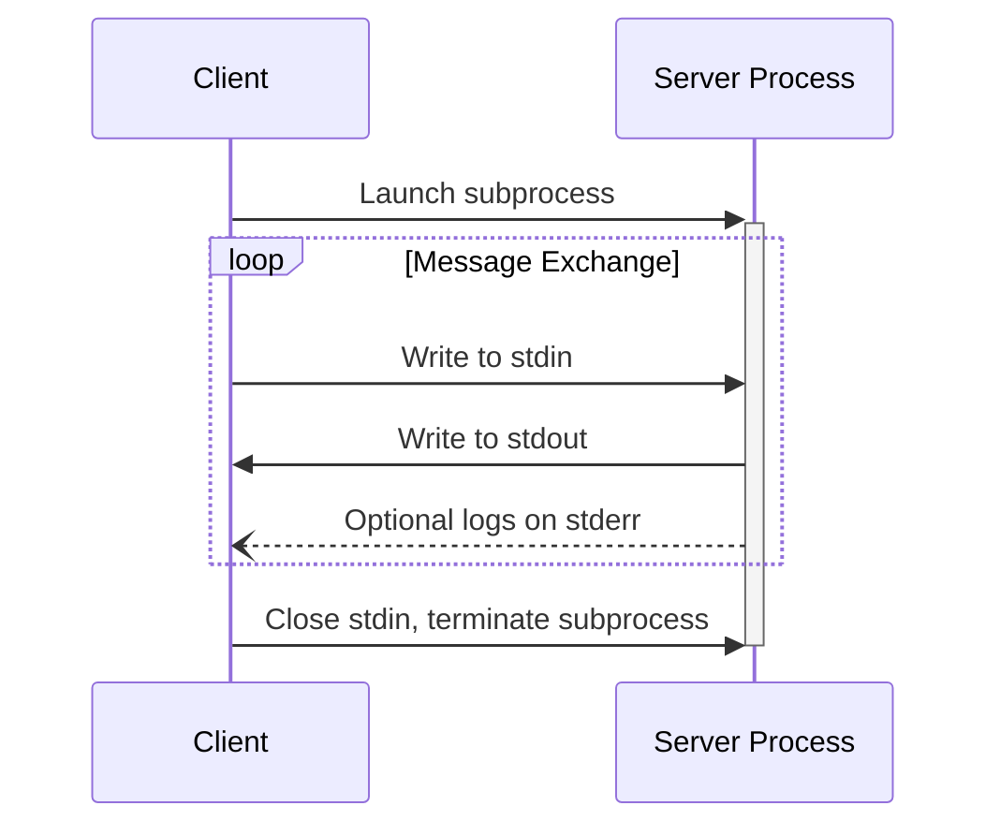

MCP uses JSON-RPC to encode messages. JSON-RPC messages **MUST** be UTF-8 encoded.

The protocol currently defines two standard transport mechanisms for client-server
communication:

1. [stdio](#stdio), communication over standard in and standard out
2. [Streamable HTTP](#streamable-http)

Clients **SHOULD** support stdio whenever possible.

It is also possible for clients and servers to implement
[custom transports](#custom-transports) in a pluggable fashion.

## stdio

In the **stdio** transport:

- The client launches the MCP server as a subprocess.
- The server reads JSON-RPC messages from its standard input (`stdin`) and sends messages
  to its standard output (`stdout`).
- Messages are individual JSON-RPC requests, notifications, or responses.
- Messages are delimited by newlines, and **MUST NOT** contain embedded newlines.
- The server **MAY** write UTF-8 strings to its standard error (`stderr`) for any
  logging purposes including informational, debug, and error messages.
- The client **MAY** capture, forward, or ignore the server's `stderr` output
  and **SHOULD NOT** assume `stderr` output indicates error conditions.
- The server **MUST NOT** write anything to its `stdout` that is not a valid MCP message.
- The client **MUST NOT** write anything to the server's `stdin` that is not a valid MCP
  message.

